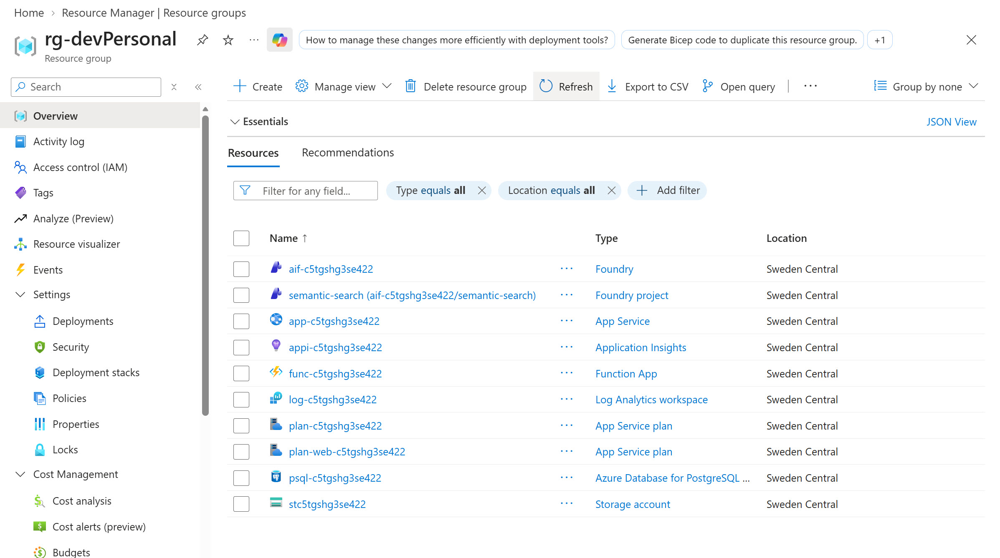
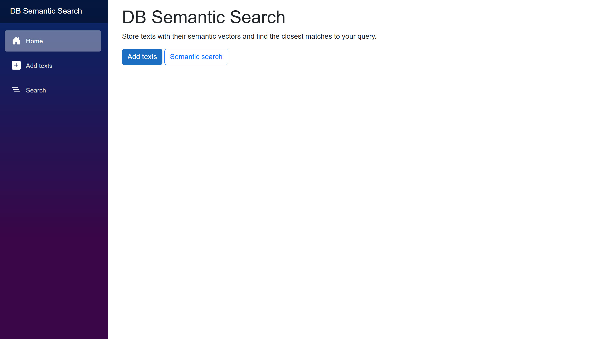
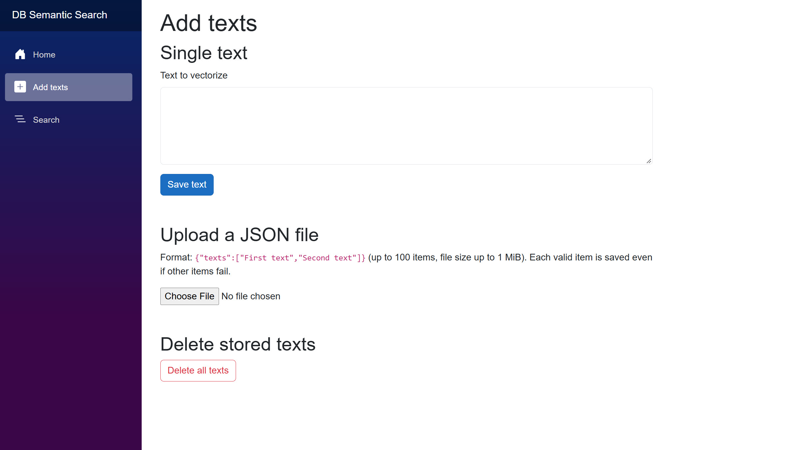
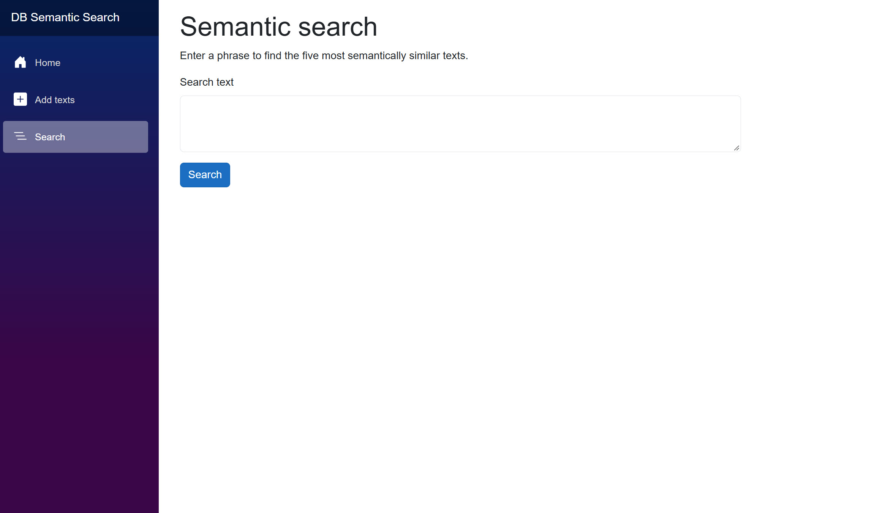

# DB Semantic Search - Demo Guide

The following demo steps are intended as a guideline for presenting the scenario after deployment.

## 1. What Resources are getting deployed

This scenario deploys a web application for storing text and finding semantically similar content. The Blazor Server frontend sends requests to an Azure Functions API. The API generates text embeddings with the `text-embedding-3-large` model in Microsoft Foundry and stores the text and vectors in Azure Database for PostgreSQL using the `pgvector` extension.

The resource names use the AZD environment name or a generated token. Run `azd env get-values` to see the names and URLs for your deployment.

- `rg-<environment-name>` - Azure resource group containing the scenario resources.
- `app-<token>` - Windows App Service hosting the Blazor Server user interface.
- `plan-web-<token>` - Basic App Service plan for the web application.
- `func-<token>` - Linux Azure Functions app hosting the .NET isolated API. Its system-assigned managed identity accesses Foundry and PostgreSQL.
- `plan-<token>` - Flex Consumption plan for the Functions app.
- `st<token>` - Storage account used by Azure Functions for its deployment package and runtime storage.
- `psql-<token>` - Azure Database for PostgreSQL Flexible Server, configured for Microsoft Entra authentication and the `vector` extension.
- `semantic_search` - PostgreSQL database containing the stored texts and their embeddings.
- `aif-<token>` - Microsoft Foundry account hosting the embedding model deployment.
- `semantic-search` - Foundry project created for the scenario.
- `text-embedding-3-large` - Global Standard model deployment used to create text embeddings.
- `appi-<token>` - Application Insights instance used for application telemetry.
- `log-<token>` - Log Analytics workspace backing Application Insights.



## 2. What can I demo from this scenario after deployment

Open the deployed web application using `AZURE_WEB_APP_URL` from `azd env get-values`. The interface has a home page, a page for adding text, and a semantic search page.

### Home page



The home page introduces the scenario and provides direct links to **Add texts** and **Semantic search**. Explain that the application stores text together with a vector representation, so a search can find related meaning rather than only matching exact words.

### Add texts



Select **Add texts** to demonstrate either input method:

1. Enter a text in **Single text** and select **Save text**. A successful save displays the new text ID.
2. To add several items at once, upload a JSON file containing a `texts` array. For example:

   ```json
   {
     "texts": [
       "PostgreSQL stores relational data and supports vector similarity search.",
       "Azure Functions can run serverless APIs that connect to managed services.",
       "Text embeddings represent meaning as vectors for semantic search."
     ]
   }
   ```

   The batch can contain up to 100 texts and the file can be up to 1 MiB. The page reports how many items were saved and shows item-level errors if any entries could not be processed.

Each valid text is embedded and stored as it is processed. The model and database operations happen in the backend, not in the browser.

### Semantic search



Select **Search** and enter a phrase related to the example texts, such as `finding information by meaning rather than exact wording`. The results show up to five stored texts, ordered by semantic similarity, together with their cosine distance. A lower distance indicates a closer match. This is a useful way to demonstrate that a query can find related content even when it does not repeat the same words.

If the database has no stored texts yet, the page reports that there are no texts to search. Add a few examples first, then run the query again.

### Optional cleanup

The **Delete all texts** action on the Add texts page permanently deletes all stored texts and embeddings after a confirmation prompt. Use it only when you intend to reset the demo data. The application does not require user authentication, so anyone who can access the app can perform this action.